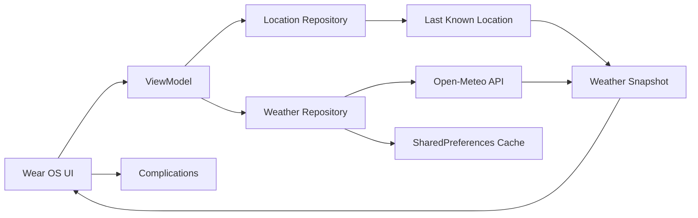

# Wind Wear OS

<p align="center">
  
  
  
  
</p>

A compact Wear OS weather app built for quick glanceability. It helps the user check current wind speed, gusts, and direction from their wrist without opening a phone app.

## Product Intro

Wind Wear OS is a first-pass wearable experience designed around the idea that a watch should surface only the most important information at a glance. The app focuses on a single question: what is the current wind doing right now?

It combines:

- live weather data
- location awareness
- local cache fallback
- a clean watch-first UI
- complication support for fast status checks

## How It Works



## Features

- Live wind speed and gust readings from Open-Meteo
- Current-direction readout with a watch-friendly summary
- Location-aware fetch flow using Android location APIs
- Permission-aware behavior for location access
- Cached weather and last-known location fallback
- Jetpack Compose watch UI
- Additional complications for sustained wind, gusts, and summary status

## Screenshots

> Add screenshots here as the app is refined and tested on a Wear OS emulator or watch.

```text
[App screenshot placeholder]
[Complication screenshot placeholder]
```

## Tech Stack

- Kotlin
- Jetpack Compose for Wear OS
- Android Gradle Plugin
- Google Play Services Location
- Retrofit
- Moshi
- Kotlin Coroutines
- SharedPreferences

## Prerequisites

- Android Studio
- JDK 17
- Android SDK 35
- Wear OS emulator image or physical Wear OS device

## Setup

1. Install Android Studio.
2. Install JDK 17.
3. Open the project folder in Android Studio.
4. Let Gradle sync finish.
5. Open SDK Manager and install the required packages:
   - Android 35 platform
   - Android Emulator
   - Wear OS system image
6. Create or select a Wear OS AVD.
7. Run the app from Android Studio.

## Local Configuration

Android Studio usually manages the SDK automatically. If needed, set your local SDK path in `local.properties`:

```properties
sdk.dir=C:\Users\<your-user>\AppData\Local\Android\Sdk
```

## Permissions

The app requests location permission so it can determine the user’s current position and fetch local weather data.

## API

Weather data is fetched from the Open-Meteo forecast API.

## Project Structure

```text
Wear-OS/
├── app/
│   ├── src/main/java/com/example/wind/
│   │   ├── complication/
│   │   ├── data/
│   │   ├── ui/
│   │   └── util/
│   └── src/main/res/
├── build.gradle.kts
├── settings.gradle.kts
├── gradle.properties
├── gradlew
├── gradlew.bat
├── README.md
├── .gitignore
└── .idea/
```

## Notes

This project is a starting point for building a practical wearable weather product. It focuses on watch-friendly data, simple interactions, and a compact app experience designed for a small screen.

## License

This project is provided for learning and experimentation. Use and adapt it as needed for personal or educational projects.
