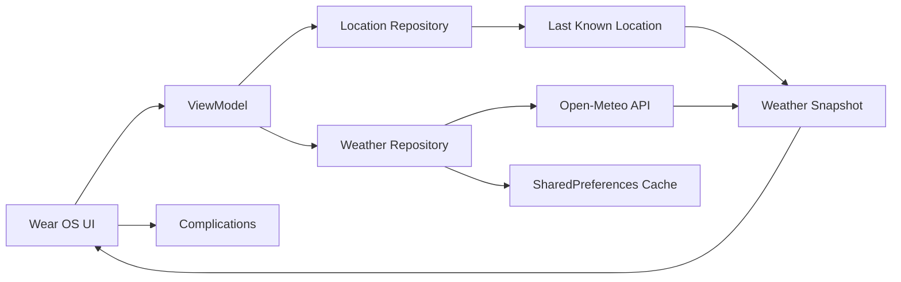

# Wind Wear OS

<p align="center">
  
  
  
  
</p>

## TL;DR

A Wear OS weather app for checking wind conditions at a glance — built for fast answers, live location data, and simple watch-first interactions.

## Value Proposition

Wind Wear OS is designed for a single purpose: give the user the most important wind information in less than a second. Instead of forcing a full phone-like dashboard onto a tiny watch screen, it prioritizes the few data points that matter most: sustained wind, gusts, and direction.

It turns a noisy weather feed into a wearable product experience that feels natural on a watch.

## Why This App Exists

People check the weather in short bursts, and a watch is best at answering a few quick questions instead of showing a full dashboard. This app exists to make wind conditions immediately useful on a wearable screen: what is the sustained wind speed, how strong are the gusts, and which direction is it coming from?

The goal is to turn a noisy weather feed into a compact, glanceable wearable experience that feels natural on a watch face or a watch app.

## Built For

- quick weather checks from the wrist
- outdoor users who care about wind conditions
- watch-first utility apps
- compact, glanceable mobile experiences
- wearable prototypes and product experiments

## How It Works



## Screenshots

These placeholders can be replaced with real screenshots from the emulator or a physical watch once the app is run on device.

<p align="center">
  
  
</p>

## Features By Screen

### Watch screen
- current sustained wind speed
- current gust speed
- wind direction label
- refresh action for manual update
- cached fallback state when data is stale

### Complications
- sustained wind status
- gust summary
- combined weather summary
- quick glance view without opening the app

## Features

- Live wind speed and gust readings from Open-Meteo
- Current-direction readout with a watch-friendly summary
- Location-aware fetch flow using Android location APIs
- Permission-aware behavior for location access
- Cached weather and last-known location fallback
- Jetpack Compose watch UI
- Additional complications for sustained wind, gusts, and summary status

## Tech Stack

- Kotlin
- Jetpack Compose for Wear OS
- Android Gradle Plugin
- Google Play Services Location
- Retrofit
- Moshi
- Kotlin Coroutines
- SharedPreferences

## Prerequisites

- Android Studio
- JDK 17
- Android SDK 35
- Wear OS emulator image or physical Wear OS device

## Setup

1. Install Android Studio.
2. Install JDK 17.
3. Open the project folder in Android Studio.
4. Let Gradle sync finish.
5. Open SDK Manager and install the required packages:
   - Android 35 platform
   - Android Emulator
   - Wear OS system image
6. Create or select a Wear OS AVD.
7. Run the app from Android Studio.

## Local Configuration

Android Studio usually manages the SDK automatically. If needed, set your local SDK path in `local.properties`:

```properties
sdk.dir=C:\Users\<your-user>\AppData\Local\Android\Sdk
```

## Permissions

The app requests location permission so it can determine the user’s current position and fetch local weather data.

## API

Weather data is fetched from the Open-Meteo forecast API.

## Project Structure

```text
Wear-OS/
├── app/
│   ├── src/main/java/com/example/wind/
│   │   ├── complication/
│   │   ├── data/
│   │   ├── ui/
│   │   └── util/
│   └── src/main/res/
├── build.gradle.kts
├── settings.gradle.kts
├── gradle.properties
├── gradlew
├── gradlew.bat
├── README.md
├── .gitignore
└── .idea/
```

## Roadmap / Next Steps

- improve UI polish and spacing for small watch screens
- add better stale-data handling and offline states
- support additional weather metrics beyond wind
- refine complication design and placement
- test on a real Wear OS device and tune usability
- explore a wider weather dashboard experience for wearables

## Notes

This project is a starting point for building a practical wearable weather product. It focuses on watch-friendly data, simple interactions, and a compact app experience designed for a small screen.

## License

This project is provided for learning and experimentation. Use and adapt it as needed for personal or educational projects.
